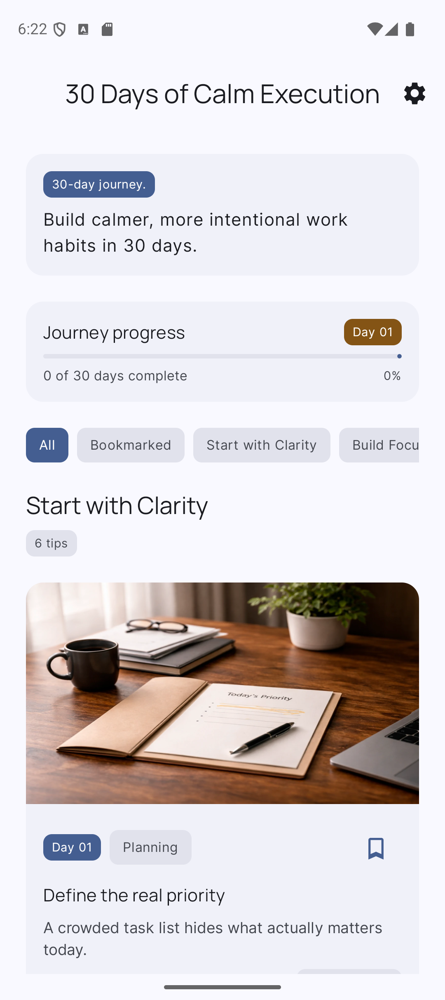
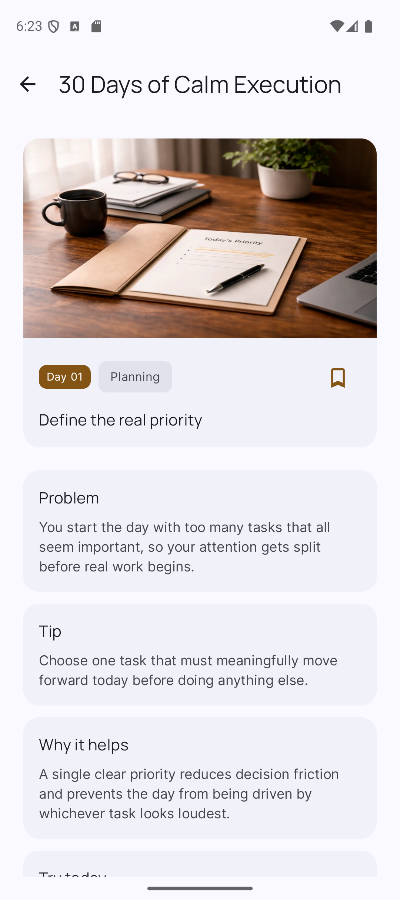
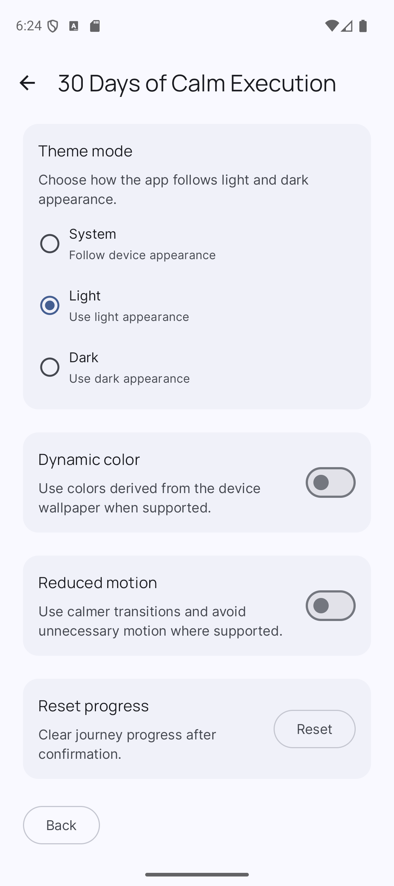
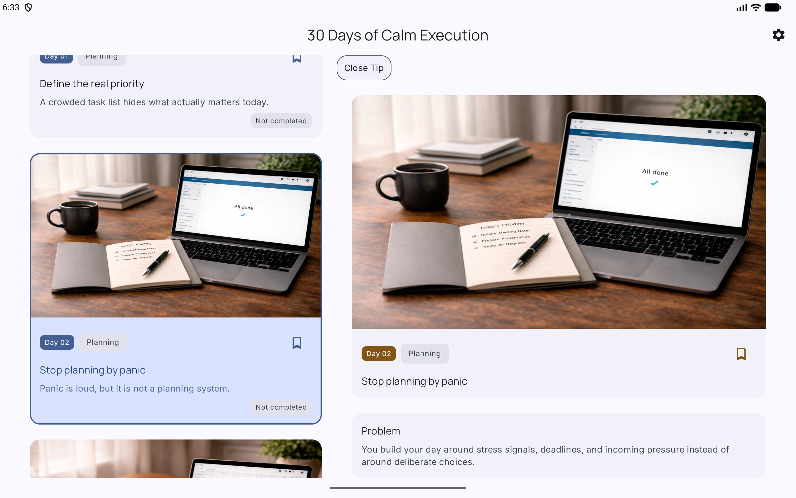

# 30 Days of Calm Execution

**Kotlin-first Android portfolio project built with Jetpack Compose, Material 3, Hilt, Proto DataStore, Flow, repository-based architecture, and tested local persistence.**

`30 Days of Calm Execution` is an Android app that presents a structured 30-day journey of practical work-habit tips.

The product focus is calm execution: starting work with clarity, protecting attention, reducing reactive habits, sustaining energy, and finishing meaningful work without burnout-style productivity noise.

This repository is being developed as a **hiring-facing Android portfolio project**. It is not presented as a finished public-store consumer app.

It demonstrates disciplined Android implementation: clean data boundaries, stable domain models, local source of truth, Proto DataStore persistence, repository contracts, Compose UI state, Kotlin tests, adaptive layouts, and incremental milestone-based delivery.

---

## 60-second overview

| Area | Current state |
|---|---|
| App type | Native Android app |
| Language | Kotlin |
| UI | Jetpack Compose + Material 3 |
| Architecture | Layered architecture, ViewModel-driven UI state, repository-based data layer |
| Persistence | Proto DataStore for mutable local journey state and preferences |
| Content source | Bundled JSON catalog with validation |
| Dependency injection | Hilt application, repository, DataStore, serialization, and image resolver modules |
| Implemented milestones | A — Foundation, B — Local truth, C — First usable slice, D — Product completeness, E — Release hardening baseline |
| Current repo audit status | R-series GitHub repo review complete |
| Final repo review verdict | Mostly yes |
| Portfolio classification | Ready after cleanup |
| Current cleanup focus | Portfolio presentation truth-sync: README status, completion behavior wording, release-doc links, and CI/local test-scope clarity |

The current implementation supports the local product flow:

**browse the 30-day journey → open a tip detail screen → bookmark a tip → complete a tip from Detail or selected expanded Detail → adjust app preferences → use compact or expanded layouts → keep local state consistent through repositories and Proto DataStore.**

---

## Product concept

The app helps users build better work habits through 30 daily tips. Each day is structured around one practical idea, not vague motivation.

Each tip contains:

- a real work problem;
- one practical recommendation;
- why the recommendation helps;
- one action to try today;
- a category;
- image metadata and accessibility description.

Product philosophy:

> Good work is not frantic, reactive, or performative.  
> Good work is calm, focused, intentional, and sustainable.

---

## User experience

### Home screen

The Home screen implements the **Editorial Journey Layout**:

1. top app bar / app shell;
2. intro block;
3. 30-day journey progress strip;
4. phase chip row;
5. sectioned feed of editorial tip cards.

The Home screen renders real catalog content and supports:

- loading state;
- error state;
- empty filtered-result state;
- section filtering;
- bookmark toggles;
- read-only completion status display;
- navigation into a detail screen.

Home does **not** mutate completion state. Completion changes happen from the Detail screen or from the selected Detail pane in expanded layout.

### Tip card

Each tip card presents:

- image area / image reference;
- day label;
- title;
- preview text;
- category chip;
- bookmark state;
- read-only completion state.

The card opens the correct tip detail destination using the stable `TipId`, not the display day number.

### Detail screen

The Detail screen preserves the approved reading order:

1. image;
2. day number;
3. title;
4. category;
5. problem;
6. tip;
7. why it helps;
8. try today;
9. bookmark / completion actions.

Opening a detail screen marks the tip as viewed, but journey progress is derived from completion/progression state rather than last viewed state.

### Expanded layout

On larger screens, the app uses a list-detail layout:

- the journey feed remains visible;
- the selected tip renders in a detail pane;
- bookmark and completion actions apply only to the selected opened detail;
- clearing selection returns the user to the feed-focused state.

### Settings screen

The Settings screen supports:

- theme mode selection;
- dynamic color toggle;
- reduced motion toggle;
- reset progress flow with confirmation;
- app shell reaction to persisted preference changes.

---

## Screenshots

These screenshots are captured from the debug build and show the current portfolio-facing UI state.

| Home                                                                                     | Detail                                                                       |
|------------------------------------------------------------------------------------------|------------------------------------------------------------------------------|
|  |  |

| Settings                                                                             | Expanded / tablet                                                                                                 |
|--------------------------------------------------------------------------------------|-------------------------------------------------------------------------------------------------------------------|
|  |  |

The screenshots are committed as repository documentation assets under `docs/screenshots/` so reviewers can understand the app’s UI without building the project locally.

---

## Current implementation status

### Release/audit state

The repository has passed the main implementation milestones and has an rc1 release-hardening documentation baseline.

Current status:

| Area | Status |
|---|---|
| Core product implementation | Done |
| Local catalog and persistence | Done |
| Home / Detail / Settings | Done |
| Compact navigation | Done |
| Expanded adaptive layout | Done |
| Runtime image asset pipeline | Done |
| Unit test baseline | Done |
| Local connected UI/adaptive evidence | Done, local emulator scope |
| Release-hardening docs | Present |
| Public portfolio presentation | Needs cleanup |

Current repository verdict:

```text
Engineering implementation: Strong
Architecture: Strong
Behavior verification: Mostly proven, with test-scope cleanup needed
Build / CI: Functional, but not release-clean
Public safety: Pass
Portfolio presentation: Needs cleanup
Overall: Mostly yes
```

### Completed — Milestone A: Foundation

- Android project baseline;
- Gradle / AGP / Kotlin / Compose setup;
- GitHub Actions Android CI;
- Hilt application bootstrap;
- Compose app shell;
- core domain models;
- bundled `tips_catalog.json`;
- catalog DTOs;
- catalog data source;
- catalog mapper;
- catalog validator;
- catalog repository;
- image resolver contract and implementation;
- catalog validation tests;
- actual bundled catalog validation.

### Completed — Milestone B: Local truth

- `journey_state.proto`;
- `user_preferences.proto`;
- Journey serializer, data source, mapper, repository, and mutation flows;
- Preferences serializer, data source, mapper, and repository;
- bookmark persistence;
- completion persistence;
- viewed-state persistence;
- selected-section persistence;
- theme / dynamic color / reduced motion preference persistence;
- reset progress behavior;
- Hilt modules for app, data, repositories, DataStore, serialization, and image resolving;
- repository and failure-path tests.

### Completed — Milestone C: First usable slice

- Material 3 design-system integration;
- app token layer for colors, typography, shapes, spacing, elevation, and motion;
- shared top bar, chips, labels, error panel, and loading placeholders;
- typed route specs;
- NavHost with Home, TipDetail, and Settings routes;
- compact back behavior;
- invalid `tipId` handling path;
- Home route, state, actions, ViewModel, and screen;
- intro block;
- journey progress strip;
- phase chip row;
- grouped feed;
- editorial tip card;
- real catalog rendering;
- bookmark toggle;
- read-only Home completion status;
- section filtering;
- loading, error, and empty states;
- Tip Detail route, state, actions, ViewModel, and screen;
- detail meta block, content block, section cards, and action row;
- `markViewed()` on detail open;
- Home UI tests;
- Detail UI tests;
- compact navigation tests;
- Home / Detail ViewModel tests.

### Completed — Milestone D: Product completeness

- Settings state, actions, ViewModel, route, and screen;
- theme mode preference row;
- dynamic color preference row;
- reduced motion preference row;
- reset progress flow;
- reset confirmation dialog;
- app shell reaction to settings changes;
- expanded app shell;
- list-detail layout for larger screens;
- feed pane and selected detail pane;
- empty detail placeholder;
- selection/back behavior for expanded layout;
- compact layout preserved;
- preview data;
- fake repositories;
- sample UI states;
- preview-only content helpers;
- screen previews that do not depend on runtime DI;
- 30 runtime WebP assets;
- runtime image directory under `drawable-nodpi`;
- image-key to drawable mapping;
- finalized image content descriptions;
- fallback asset support.

### Completed — Milestone E: Release-hardening baseline

Release-hardening docs exist under `docs/release/`:

- [`v1.0.0-rc1_release_notes.md`](docs/release/v1.0.0-rc1_release_notes.md)
- [`v1.0.0-rc1_known_issues.md`](docs/release/v1.0.0-rc1_known_issues.md)
- [`rollback_hotfix_path.md`](docs/release/rollback_hotfix_path.md)
- [`monitoring_crash_reporting_plan.md`](docs/release/monitoring_crash_reporting_plan.md)
- [`post_release_ownership.md`](docs/release/post_release_ownership.md)
- [`follow_up_review_schedule.md`](docs/release/follow_up_review_schedule.md)

Remaining work is now portfolio cleanup and evidence hardening, not core feature construction.

---

## Tech stack

| Category | Technology |
|---|---|
| Language | Kotlin |
| UI | Jetpack Compose |
| Design | Material 3 |
| Architecture | UI layer + data layer, repository pattern, ViewModel state holders |
| Async/state | Kotlin coroutines, Flow / StateFlow |
| Persistence | Proto DataStore |
| Serialization | kotlinx.serialization for bundled JSON |
| Dependency injection | Hilt |
| Testing | JUnit unit tests, ViewModel tests, Compose UI tests, navigation tests |
| Build | Gradle, Android Gradle Plugin, Version Catalog |
| CI | GitHub Actions |

Current baseline:

```text
AGP: 9.1.1
Gradle wrapper: 9.3.1
Kotlin: 2.2.20
JDK: 17
Compose BOM: 2026.02.01
minSdk: 24
targetSdk: 36
compileSdk: 36.1
```

---

## Architecture

The project separates two different truths:

1. **Immutable editorial catalog** — the 30 tips and their section metadata.
2. **Mutable user state** — viewed tips, completion status, bookmarks, timestamps, selected section, and preferences.

Current high-level shape:

```text
Compose UI layer
        ↓
ViewModel layer
        ↓
Repository layer
        ↓
Data sources
        ↓
Bundled JSON / Proto DataStore / image resources
```

Catalog flow:

```text
res/raw/tips_catalog.json
        ↓
RawResourceCatalogDataSource
        ↓
CatalogValidator
        ↓
CatalogMapper
        ↓
CatalogRepository
        ↓
Domain models
```

Journey state flow:

```text
Proto DataStore
        ↓
JourneyDataSource
        ↓
JourneyStateMapper
        ↓
JourneyRepository
        ↓
JourneyUserState / TipUserState
```

Preferences flow:

```text
Proto DataStore
        ↓
PreferencesDataSource
        ↓
PreferencesMapper
        ↓
PreferencesRepository
        ↓
UserPreferences
```

UI code consumes state through ViewModels and repositories. It should not read JSON, DataStore, or Proto classes directly.

### Route / Screen / ViewModel split

The UI follows a Route / Screen / ViewModel pattern:

- `Route` composables wire ViewModels, collect UI state, and handle navigation callbacks.
- `Screen` composables render immutable state and emit typed actions.
- `ViewModel` classes own screen business state and convert repository data into screen-ready `UiState`.

This keeps navigation, rendering, and business-state ownership separated.

### Adaptive architecture

Compact and expanded layouts use the same catalog, repositories, user-state model, and ViewModel-driven data flow.

Compact mode uses destination-style navigation:

```text
Home → TipDetail → Back
```

Expanded mode uses list-detail presentation:

```text
Journey feed + selected detail pane
```

The expanded layout is not a second architecture. It is a different presentation of the same app state.

---

## Package structure

Current important packages:

```text
com.example.a30daysofcalmexecution
  CalmExecutionApp.kt
  MainActivity.kt

com.example.a30daysofcalmexecution.core.model
  JourneyCatalog.kt
  JourneyUserState.kt
  SectionKey.kt
  ThemeMode.kt
  Tip.kt
  TipBody.kt
  TipCategoryKey.kt
  TipCompletionStatus.kt
  TipId.kt
  TipImageRef.kt
  TipSection.kt
  TipUserState.kt
  UserPreferences.kt

com.example.a30daysofcalmexecution.core.data.catalog
  CatalogDataSource.kt
  CatalogDto.kt
  CatalogMapper.kt
  CatalogRepository.kt
  CatalogRepositoryImpl.kt
  CatalogValidationResult.kt
  CatalogValidator.kt
  RawResourceCatalogDataSource.kt
  SectionDto.kt
  TipDto.kt

com.example.a30daysofcalmexecution.core.data.images
  DrawableTipImageResolver.kt
  TipImageResolver.kt

com.example.a30daysofcalmexecution.core.data.journey
  DataStoreJourneyDataSource.kt
  JourneyDataSource.kt
  JourneyRepository.kt
  JourneyRepositoryImpl.kt
  JourneyStateMapper.kt
  JourneyStateSerializer.kt

com.example.a30daysofcalmexecution.core.data.preferences
  DataStorePreferencesDataSource.kt
  PreferencesDataSource.kt
  PreferencesMapper.kt
  PreferencesRepository.kt
  PreferencesRepositoryImpl.kt
  UserPreferencesSerializer.kt

com.example.a30daysofcalmexecution.di
  AppModule.kt
  DataModule.kt
  DataStoreModule.kt
  RepositoryModule.kt
  SerializationModule.kt

com.example.a30daysofcalmexecution.navigation
  AppRoute.kt
  CalmExecutionNavHost.kt

com.example.a30daysofcalmexecution.ui.home
  HomeAction.kt
  HomeRoute.kt
  HomeScreen.kt
  HomeUiState.kt
  HomeViewModel.kt
  HomeIntroBlock.kt
  JourneyProgressStrip.kt
  SectionChipRow.kt
  TipCard.kt
  TipSectionFeed.kt

com.example.a30daysofcalmexecution.ui.detail
  TipDetailAction.kt
  TipDetailRoute.kt
  TipDetailScreen.kt
  TipDetailUiState.kt
  TipDetailViewModel.kt
  TipDetailMetaBlock.kt
  TipDetailContentBlock.kt
  TipDetailActionsRow.kt

com.example.a30daysofcalmexecution.ui.settings
  SettingsAction.kt
  SettingsRoute.kt
  SettingsScreen.kt
  SettingsUiState.kt
  SettingsViewModel.kt

com.example.a30daysofcalmexecution.ui.adaptive
  AdaptiveAppShell.kt
  ExpandedJourneyRoute.kt
  ExpandedListDetailLayout.kt

com.example.a30daysofcalmexecution.ui.preview
  PreviewContent.kt
  PreviewData.kt
  PreviewUiStates.kt
  ScreenPreviews.kt
  fake/
```

Generated Proto classes are build output and should remain under `build/generated/...`. They should not be manually committed as source files.

---

## Domain model summary

### Catalog domain

The immutable catalog contains:

- `JourneyCatalog`;
- `TipSection`;
- `Tip`;
- `TipBody`;
- `TipImageRef`;
- `TipId`;
- `SectionKey`;
- `TipCategoryKey`.

Example stable tip ID:

```text
day_01_define_real_priority
```

Day number is presentation order. The stable string ID is the identity used for persistence, bookmarks, navigation, and future analytics.

### Journey user state

Mutable journey state contains:

- active / viewed tip state;
- per-tip completion status;
- bookmark state;
- last viewed timestamp;
- completed timestamp.

This state is persisted through Proto DataStore.

### Preferences state

Preferences include:

- theme mode;
- dynamic color enabled;
- reduced motion enabled;
- last selected section;
- intro seen flag.

Preferences are persisted through Proto DataStore and exposed through `PreferencesRepository`.

---

## Repository contracts

### CatalogRepository

Responsible for immutable tip content.

```kotlin
interface CatalogRepository {
    suspend fun getCatalog(): JourneyCatalog
    suspend fun getTip(tipId: TipId): Tip?
    suspend fun getSection(sectionKey: SectionKey): TipSection?
    suspend fun getTipsForSection(sectionKey: SectionKey): List<Tip>
    suspend fun getAdjacentTipIds(tipId: TipId): AdjacentTipIds
}
```

### JourneyRepository

Responsible for mutable journey progress.

```kotlin
interface JourneyRepository {
    fun observeJourneyState(): Flow<JourneyUserState>
    fun observeTipState(tipId: TipId): Flow<TipUserState>
    suspend fun markViewed(tipId: TipId)
    suspend fun setBookmarked(tipId: TipId, bookmarked: Boolean)
    suspend fun setCompletionStatus(tipId: TipId, status: TipCompletionStatus)
    suspend fun resetProgress()
}
```

### PreferencesRepository

Responsible for app-level preferences.

```kotlin
interface PreferencesRepository {
    fun observePreferences(): Flow<UserPreferences>
    suspend fun setThemeMode(themeMode: ThemeMode)
    suspend fun setDynamicColorEnabled(enabled: Boolean)
    suspend fun setReducedMotionEnabled(enabled: Boolean)
    suspend fun setLastSelectedSection(sectionKey: SectionKey?)
    suspend fun setHasSeenIntro(seen: Boolean)
}
```

Repository consumers work with domain models, not DTO or Proto models.

---

## Validation and tests

The project has a test suite covering the local data model, repositories, ViewModels, navigation, and the Home / Detail / adaptive app flow.

### Catalog validation coverage

Catalog tests verify:

- exactly 30 tips;
- unique tip IDs;
- unique day numbers;
- valid day numbers;
- valid section keys;
- valid category keys;
- valid section definitions;
- section day ranges match contained tips;
- non-blank editorial fields;
- valid image accessibility metadata;
- image-key validation callback behavior;
- actual bundled `tips_catalog.json` validity.

### Journey persistence coverage

Journey tests verify:

- Proto serializer default value;
- Proto serializer round trip;
- corrupted Proto handling;
- DataStore-backed journey data source behavior;
- Proto-to-domain mapping;
- domain-to-Proto mapping;
- default / blank / zero Proto value handling;
- full journey state observation;
- single tip state observation;
- `markViewed()` mutation;
- bookmark mutation;
- completion status mutation;
- reset progress mutation.

### Preferences coverage

Preferences tests verify:

- Proto serializer behavior;
- DataStore-backed preferences behavior;
- mapping between Proto and domain models;
- theme mode mutation;
- dynamic color mutation;
- reduced motion mutation;
- selected section mutation;
- intro seen flag mutation.

### Feature coverage

Feature tests cover:

- Home UI rendering;
- Detail UI rendering;
- compact navigation behavior;
- expanded/adaptive rendering behavior;
- Home ViewModel behavior;
- Detail ViewModel behavior;
- bookmark/completion consistency between Home and Detail.

---

## Verification scope

### Commands

Run unit tests:

```bash
./gradlew testDebugUnitTest --stacktrace
```

Assemble debug build:

```bash
./gradlew assembleDebug --stacktrace
```

Assemble Android test APK:

```bash
./gradlew assembleDebugAndroidTest --stacktrace
```

Run full local JVM/debug verification:

```bash
./gradlew clean testDebugUnitTest assembleDebug --stacktrace
```

Generate Proto classes manually when needed:

```bash
./gradlew clean generateDebugProto compileDebugKotlin --stacktrace
```

### Focused local instrumentation commands

Home UI tests:

```bash
./gradlew connectedDebugAndroidTest "-Pandroid.testInstrumentationRunnerArguments.class=com.example.a30daysofcalmexecution.ui.home.HomeScreenTest" --stacktrace --no-configuration-cache
```

Detail UI tests:

```bash
./gradlew connectedDebugAndroidTest "-Pandroid.testInstrumentationRunnerArguments.class=com.example.a30daysofcalmexecution.ui.detail.TipDetailScreenTest" --stacktrace --no-configuration-cache
```

Compact navigation tests:

```bash
./gradlew connectedDebugAndroidTest "-Pandroid.testInstrumentationRunnerArguments.class=com.example.a30daysofcalmexecution.navigation.CompactNavigationTest" --stacktrace --no-configuration-cache
```

Adaptive app shell tests:

```bash
./gradlew connectedDebugAndroidTest "-Pandroid.testInstrumentationRunnerArguments.class=com.example.a30daysofcalmexecution.ui.adaptive.AdaptiveAppShellTest" --stacktrace --no-configuration-cache
```

Expanded list-detail tests:

```bash
./gradlew connectedDebugAndroidTest "-Pandroid.testInstrumentationRunnerArguments.class=com.example.a30daysofcalmexecution.ui.adaptive.ExpandedListDetailLayoutTest" --stacktrace --no-configuration-cache
```

### CI vs local verification

| Scope | Verification | CI-backed? | Notes |
|---|---|---:|---|
| Unit / JVM tests | `./gradlew testDebugUnitTest --stacktrace` | Yes | Runs in GitHub Actions |
| Debug build | `./gradlew assembleDebug --stacktrace` | Yes | Runs in GitHub Actions |
| Android test APK assembly | `./gradlew assembleDebugAndroidTest --stacktrace` | No | Local verification |
| Home / Detail Compose UI tests | filtered `connectedDebugAndroidTest` | No | Local emulator evidence |
| Compact navigation tests | filtered `connectedDebugAndroidTest` | No | Local emulator evidence; compact/phone-oriented scope |
| Adaptive / tablet tests | filtered `connectedDebugAndroidTest` | No | Local emulator evidence |
| Lint gate | Not configured as CI release gate yet | No | Future hardening |
| Release build gate | Not configured as CI release gate yet | No | Future public-store hardening |
| Connected Android tests in CI | Not configured yet | No | Future device-matrix hardening |

The phrase “CI-backed verification” in this README means **unit tests plus debug assembly**, not full connected UI/adaptive/device-matrix testing.

---

## CI

The repository includes a GitHub Actions workflow for Android verification.

Workflow responsibilities:

- checkout;
- set up JDK 17;
- set up Gradle;
- make Gradle wrapper executable;
- run unit tests;
- assemble debug build.

The workflow runs on:

- push;
- pull request.

---

## How to run the project

Clone the repository:

```bash
git clone https://github.com/pathstoftech/calm-execution.git
cd calm-execution
```

Open the project in Android Studio, or run from the command line:

```bash
./gradlew assembleDebug
```

For verification:

```bash
./gradlew clean testDebugUnitTest assembleDebug --stacktrace
```

---

## Design direction

The visual identity is calm, modern, editorial, focused, and structured.

Material 3 direction:

| Role | Direction |
|---|---|
| Primary | Slate Indigo |
| Secondary | Muted Teal |
| Tertiary | Soft Amber |
| Typography | clear editorial hierarchy |
| Shapes | soft-rectangular, moderately rounded |
| Dynamic color | default off |

The design-system token layer is integrated.

---

## Current known portfolio caveats

These are tracked as portfolio/publication cleanup items, not release-blocking product defects:

- demo video is not committed yet;
- connected UI, navigation, and adaptive tests are local emulator evidence, not CI-backed evidence;
- some UI tests are device/orientation scoped and should not be presented as full device-matrix coverage;
- Gradle/AGP modernization warnings remain;
- package namespace still uses `com.example.a30daysofcalmexecution`;
- README and release docs are being synchronized after repo review;
- release-note completion-behavior wording still requires a separate consistency cleanup commit.

---

## Roadmap

### Milestone A — Foundation

Status: **Done**

- app bootstrap;
- core domain models;
- catalog JSON;
- catalog loader;
- catalog mapper;
- catalog validator;
- catalog repository;
- validation tests.

### Milestone B — Local truth

Status: **Done**

- journey Proto schema and serializer;
- journey DataStore source;
- journey mapper;
- journey repository;
- journey repository flow and mutation tests;
- preferences Proto schema and serializer;
- preferences DataStore source;
- preferences mapper;
- preferences repository;
- DI modules;
- repository verification tests.

### Milestone C — First usable slice

Status: **Done**

- Material 3 design-system integration;
- Navigation;
- Home screen;
- Detail screen;
- real catalog rendering;
- bookmark interaction;
- read-only Home completion status;
- Detail completion mutation;
- Home/Detail tests;
- compact navigation tests.

### Milestone D — Product completeness

Status: **Done**

- Settings;
- adaptive layout;
- preview/fake-data hardening;
- 30-image asset pipeline;
- finalized image content descriptions;
- fallback asset support.

### Milestone E — Release hardening baseline

Status: **Done for rc1 documentation baseline**

- release notes;
- known issues list;
- rollback / hotfix path;
- monitoring / crash-reporting plan;
- post-release ownership;
- follow-up review schedule.

### Current cleanup phase

Status: **In progress**

- README truth cleanup;
- screenshot/demo addition;
- release-note behavior consistency;
- test evidence cleanup;
- build warning cleanup;
- architecture/portfolio polish.

---

## Hiring signal

This project is intended to demonstrate practical Android engineering habits:

- Kotlin-first Android development;
- Jetpack Compose UI implementation;
- Material 3 design-system integration;
- clean domain modeling;
- repository-based data access;
- separation of DTO, Proto, domain, and UI models;
- local source of truth with Proto DataStore;
- defensive persistence mapping;
- Flow-based repository APIs;
- ViewModel-owned screen state;
- catalog validation for bundled product content;
- stable identifiers instead of fragile display-order identity;
- Home → Detail navigation with stable route arguments;
- bookmark/completion state consistency;
- unit-tested state transitions;
- Compose UI and navigation tests;
- adaptive list-detail layout;
- small commits aligned to implementation milestones;
- CI-backed unit/debug verification.

The next major hiring-facing improvement is **portfolio proof polish**: screenshots, demo video, release-note consistency, and clearer public evidence presentation. The core local app implementation already exists.

---

## Repository link

```text
https://github.com/pathstoftech/calm-execution
```
